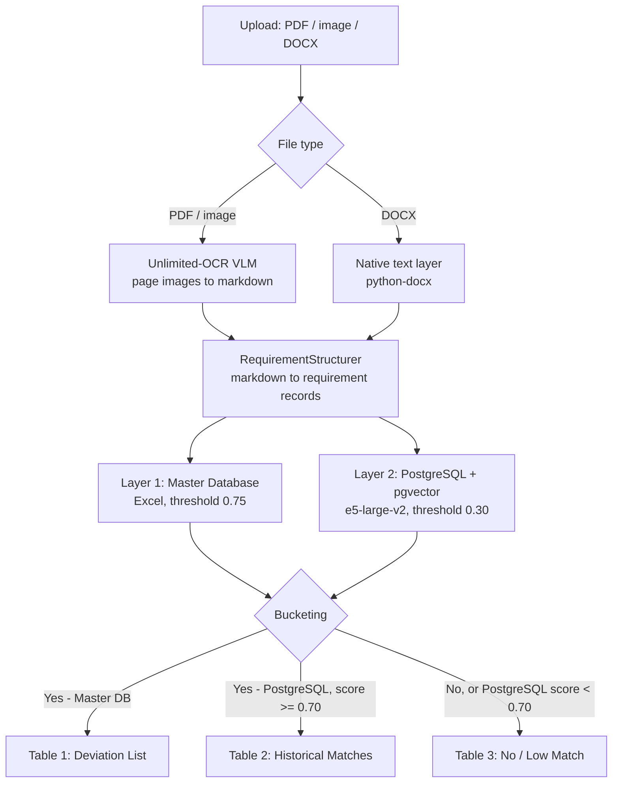

# Unlimited-OCR: How Extraction and Matching Actually Work

Branch: `unlimited-ocr-extraction`
Entry point: `app/main_ocr.py` (mode **🔍 Extract + Match Requirements**)

This document describes the code as it stands, with the real thresholds,
limits, and function names — not the intended design. Every number below is
taken from the source, and the file/line references are the authority.

---

## End-to-end flow



---

## Stage 1 — Getting text out of the document

`UnlimitedOCRProcessor.parse_document()` in `utils/unlimited_ocr_processor.py`
dispatches on file extension.

### PDF

1. **Rasterise.** `pdf_to_images()` opens the PDF with PyMuPDF and renders each
   page to PNG at `UNLIMITED_OCR_DPI` (default **300**), via
   `fitz.Matrix(dpi/72, dpi/72)`.
2. **Parse.** All pages go to the model in a single call:

   | Pages | Method | Prompt | Settings |
   |---|---|---|---|
   | 2+ | `model.infer_multi` | `<image>Multi page parsing.` | `image_size=1024`, `ngram_window=1024` |
   | 1, `image_mode="base"` | `model.infer` | `<image>document parsing.` | `base_size=1024, image_size=1024, crop_mode=False`, `ngram_window=128` |
   | 1, `image_mode="gundam"` | `model.infer` | `<image>document parsing.` | `base_size=1024, image_size=640, crop_mode=True`, `ngram_window=128` |

   Common to all: `max_length=32768`, `no_repeat_ngram_size=35`,
   `save_results=True`. Multi-page upstream only supports `base`.
3. **Post-process.** `_normalise()` takes the return value, or falls back to
   reading the `.mmd`/`.md`/`.txt` files the model wrote to `output_path`. It
   then runs `remove_det()` (strips `<|det|>type [bbox]<|/det|>` layout markers,
   drops `image` blocks, regroups lines), strips remaining special tokens, and
   collapses runs of 3+ newlines.

### DOCX

Read directly via `extract_text_from_docx` — paragraphs, then table rows joined
with `" | "`. **No OCR runs.** A DOCX already has an exact text layer;
rasterising it would only lose fidelity.

### Device selection

`_select_device_and_dtype()` picks at load time:

| Condition | Result |
|---|---|
| No CUDA | `cpu` / `float32` |
| < 6 GB free VRAM | `cpu` / `float32` |
| CUDA, SM 8.0+ (Ampere+) | `cuda` / `bfloat16` |
| CUDA, pre-Ampere | `cuda` / `float16` |

Weights are ~3.34 GB in BF16; 6 GB is the floor once activations and a
32k-token KV cache are counted.

---

## Stage 2 — Markdown to requirement records

`RequirementStructurer.structure()`. This stage is **deterministic and
rule-based** — Unlimited-OCR is a parsing model, not a reasoning model, so the
judgement Gemini used to supply is reconstructed from document structure and
requirement language.

### 2a. Candidate collection

Walks the markdown line by line, tracking the current section heading:

| Line matches | Handling |
|---|---|
| `HEADING_RE` — `#`-prefixed, or `3.2 Title` | Becomes the `source_context` for everything that follows |
| `TABLE_ROW_RE` — `\| a \| b \|` | Cells joined with `" - "`; separator rows dropped |
| `BULLET_RE` — `-`, `*`, `•`, `a)`, `1.` | Marker stripped, one candidate |
| `NOISE_RE` — `Page 3`, `1/12`, `Rev 2`, `Confidential`, `Table of Contents` | Discarded |
| Anything else | Buffered into a paragraph, then split on `[.;:]` followed by a capital/digit |

### 2b. Cleaning

Strips `**`, `__`, backticks; collapses whitespace; trims ` .;:-`. Rejects
anything shorter than `MIN_LEN` (**25**) or longer than `MAX_LEN` (**1200**)
chars, or with no 3-letter word.

### 2c. Scoring — is this a requirement, and how strong?

First matching modal wins (`MODALS`, checked in order):

| Pattern | Priority | Confidence |
|---|---|---|
| `shall` | critical | 0.95 |
| `must` | critical | 0.95 |
| `is/are required to` | critical | 0.93 |
| `required`, `mandatory` | high | 0.88 |
| `to be provided`, `will be provided` | high | 0.85 |
| `should` | high | 0.82 |
| `will` | medium | 0.75 |
| `may`, `can be`, `optional`, `preferred`, `desirable` | low | 0.65 |

A `high` result is promoted to `critical` (+0.05 confidence, capped 0.97) if the
text also contains `critical`, `safety`, `gmp`, or `mandator`.

**No modal?** Spec sheets and tables rarely say "shall", so `SPEC_PATTERNS` is
tried — min/max language, `Capacity:`-style labels, number+unit tokens, and
compliance verbs:

- 2+ patterns hit → `medium`, confidence **0.75**
- 1 pattern and length ≥ 40 → `medium`, confidence **0.65**
- otherwise → **discarded, not a requirement**

### 2d. Enrichment

- **Category** — keyword scoring of `"{section} {statement}"` against 11 lists
  (safety, compliance, performance, material, electrical, control,
  environmental, maintenance, documentation, operational, design). Highest count
  wins; runner-up becomes `subcategory`. No hits → `functional`.
- **`technical_parameters`** — `PARAM_RE` pulls value+unit pairs into
  `{"param_1": "250 mm", ...}`.
- **`compliance_standards`** — `STANDARD_RE` finds `ISO 8`, `21 CFR Part 11`,
  `GAMP 5`, `cGMP`, `ATEX`, `CE marking`, etc.
- **Dedupe** — key is the first 160 chars, non-alphanumerics stripped, lowercased.
- **`dependencies`** — up to 5 sibling IDs sharing the same section heading.

Output record (identical to what the Gemini branch produced, which is why the
database and matching code needed no changes):

```python
{
  'id': 'UOCR_REQ_001', 'text': ..., 'category': ..., 'subcategory': ...,
  'confidence': 0.95, 'source_context': ..., 'priority': 'critical',
  'technical_parameters': {...}, 'dependencies': [...],
  'compliance_standards': [...], 'notes': '',
  'extraction_method': 'unlimited_ocr_holistic'
}
```

---

## Stage 3 — Matching

Two layers run for **every** requirement. Layer 2 runs even when Layer 1 already
found a match.

### Layer 1 — Master Database (Excel)

`MasterDatabase.search_requirement(text, threshold=0.75)`:

1. **Exact match**, case-insensitive, on the `requirement` column →
   `similarity = 1.0`, `match_type = 'exact'`.
2. Otherwise **linear scan of every row**, scoring with the shared e5 semantic
   matcher, keeping the best. Returns only if `best_score >= 0.75`, as
   `match_type = 'semantic'`.

Strict on purpose — the master database is the authoritative source.

### Layer 2 — PostgreSQL + pgvector

`PostgresVectorStoreGemini.search_similar_requirements()`:

| Step | Detail |
|---|---|
| Model | `intfloat/e5-large-v2`, **1024** dimensions |
| Prefixes | Stored as `"passage: " + text`, queried as `"query: " + text` — E5 is asymmetric, and mixing the prefixes degrades scores |
| Distance | pgvector `<=>` (cosine distance) |
| Similarity | `1.0 - (distance / 2.0)` |
| **Document exclusion** | `WHERE document_name IS DISTINCT FROM %s` — **in SQL** |
| Candidates | `LIMIT min(top_k * 10, 200)` → **30** at the app's `top_k=3` |
| Threshold | **0.30** (deliberately loose; final bucketing happens later) |
| Returned | Re-sorted by similarity, cut to `top_k` = **3** |

The app calls it with `exclude_document=filename`.

> **Why the exclusion must happen in SQL.** It used to be applied to the
> returned rows in Python. If the document being processed was already stored
> — re-processing it, or extracting and matching in one pass — its own
> near-identical rows score ~0.95–1.0, take all 3 slots, and get filtered away,
> leaving nothing. The requirement then fell through to "No match" and the UI
> reported *"No high-similarity matches found in PostgreSQL"* while strong
> matches sat just below the cut.
>
> Measured on 20 stored requirements from `G_URS Tablet Coating Machine 1.pdf`
> (229 rows already in the DB): **6/20** matched at ≥0.70 before the fix,
> **20/20** after, with 0 same-document rows leaking. The 14 recovered matches
> scored **0.91–0.96** against three other documents. Fixed in `cb4c24b`.

### Bucketing into the three tables

Each requirement appends one entry per layer that matched, tagged with
`Has Match`:

| Table | Filter |
|---|---|
| **1 — Deviation List** | `Has Match` starts with `Yes - Master DB` |
| **2 — Historical Matches** | `Has Match == 'Yes - PostgreSQL'` **and** `Similarity Score >= 0.70` |
| **3 — No / Low Match** | `Has Match == 'No'`, **or** `'Yes - PostgreSQL'` with score `< 0.70` |

Note the two thresholds are different and both real: **0.30** decides whether
PostgreSQL returns a row at all, **0.70** decides whether it is trustworthy
enough for Table 2. Anything between the two lands in Table 3 for manual review.

**A requirement can appear in both Table 1 and Table 2.** Layer 2 runs
unconditionally, so a requirement matching the master database *and* a
historical document produces two rows. That is current behaviour, not a bug —
but it means the three tables do not sum to the requirement count.

---

## DOCX comment pairing

Independent of the matching above, and **entirely model-free** — comments come
from the DOCX comment parts, so nothing is inferred.

`extract_requirements_with_comments_holistically()` →
`_pair_comments_to_requirements()`:

1. `get_docx_comments_with_text_mapping()` reads the OOXML comment parts into
   `{commented_text: [comment records]}`.
2. For each requirement, against each commented span:
   - **Substring either direction** → similarity forced to **1.0**
   - else **e5 semantic similarity**
   - else (no matcher) **word-overlap Jaccard**
3. Best scoring span above `COMMENT_MATCH_THRESHOLD` (**0.75**) wins; its
   comments attach with author, the match score, and `matched_to`.

Measured on `URS Coating Machine Rev 1 - GLATT comments 03092025.docx`:
67 requirements (all unique), **63** paired with comments; comment-only mode
returns 109 commented segments.

---

## Configuration

`config.py` — this branch defines no `GEMINI_*` values.

| Setting | Default | Effect |
|---|---|---|
| `UNLIMITED_OCR_MODEL` | `baidu/Unlimited-OCR` | HF id or local weights path |
| `UNLIMITED_OCR_DEVICE` | auto | Force `cuda` / `cpu` |
| `UNLIMITED_OCR_DPI` | `300` | PDF rasterisation DPI |
| `UNLIMITED_OCR_IMAGE_MODE` | `base` | `base` or `gundam` (single page only) |
| `UNLIMITED_OCR_MAX_LENGTH` | `32768` | Generation cap |

Tunable thresholds, all in code:

| Constant | Value | Location |
|---|---|---|
| Master DB threshold | 0.75 | `master_database.search_requirement` |
| PostgreSQL search threshold | 0.30 | `main_ocr.py` search call |
| Historical table threshold | 0.70 | `main_ocr.py` bucketing |
| Comment pairing threshold | 0.75 | `COMMENT_MATCH_THRESHOLD` |
| Candidate scan limit | `min(top_k*10, 200)` | `search_similar_requirements` |

---

## Verification status

| Component | Status |
|---|---|
| Stage 2 structuring | Verified — 139 requirements from the coating PDF text layer |
| DOCX path end-to-end | Verified — 67 requirements, 63 comment pairings |
| PostgreSQL matching | Verified — 20/20 after the `cb4c24b` fix |
| Master DB layer | Loads 233 requirement-response pairs |
| **Stage 1 (the OCR model itself)** | **Not yet verified — has never been run** |

The 3.34 GB of weights are downloaded, but no PDF has been through the model
yet. On this machine `torch` is CPU-only and the T1000's 4 GB cannot hold the
model, so it runs on CPU at roughly **minutes per page**. Treat the first PDF
run as the real test of Stage 1.
